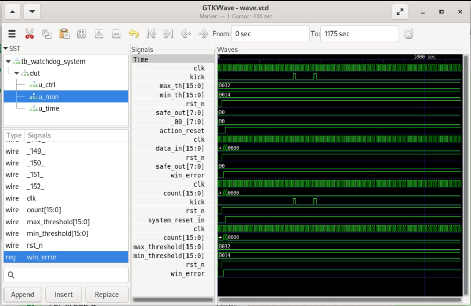

# Dual-Window-Watchdog-Timer
Low-power Dual Window Watchdog Timer implemented in Verilog with early and late fault detection, RTL design, verification, and synthesis flow.
##  Working Principle
- Counter increments continuously
- Kick signal must arrive within defined window
- Early or late kick triggers error
- System generates reset and enters safe state
---
##  Waveform Results
### Early Kick Violation
- Kick occurs before minimum threshold
- `win_error` becomes HIGH
- System triggers reset

---
##  Future Improvements
- Add Late Kick waveform
- Implement UPF file
- Add power-aware simulation
- Include DVFS or clock gating
---
##  Tools Used
- Verilog HDL
- Icarus Verilog
- Yosys
- GTKWave
- Rocky Linux
---
## 👨‍💻 Author
K Yashwanth  
**Academic Project | VLSI | Verilog | Low Power Design**
